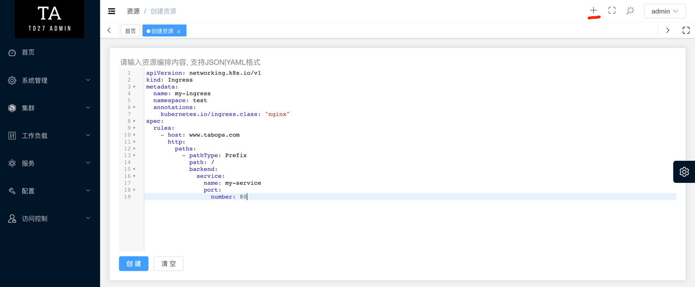
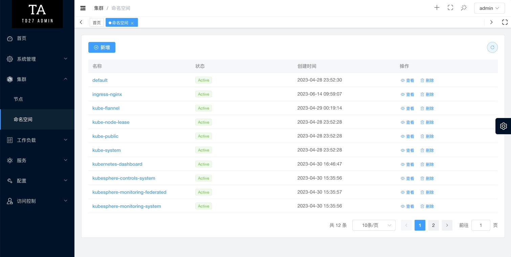
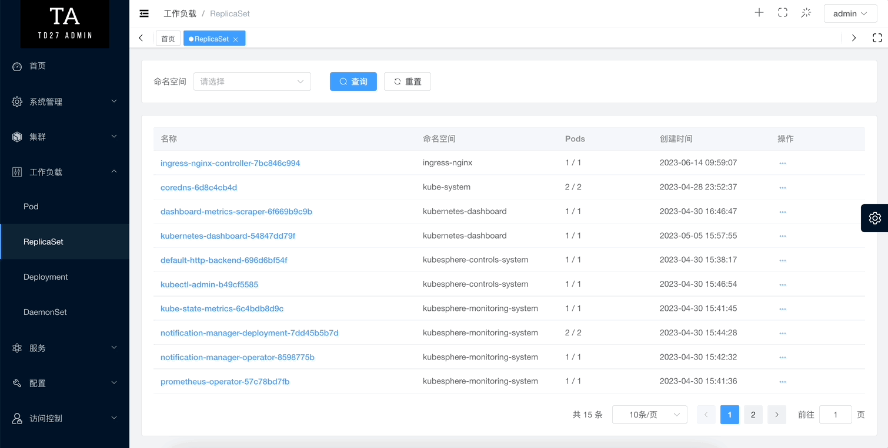
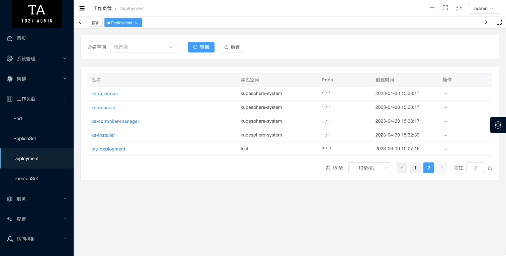
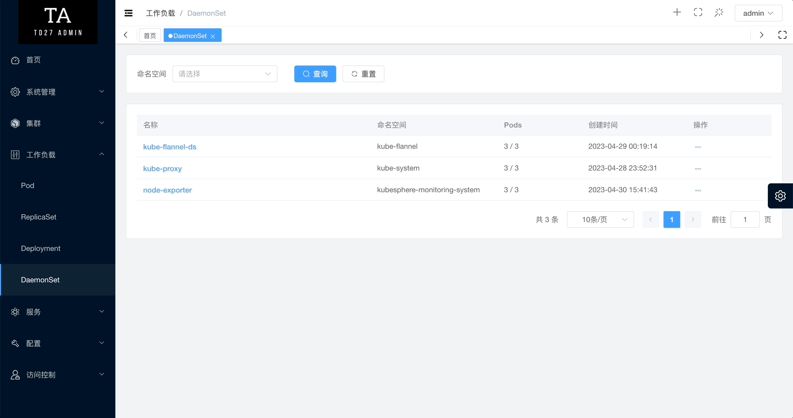
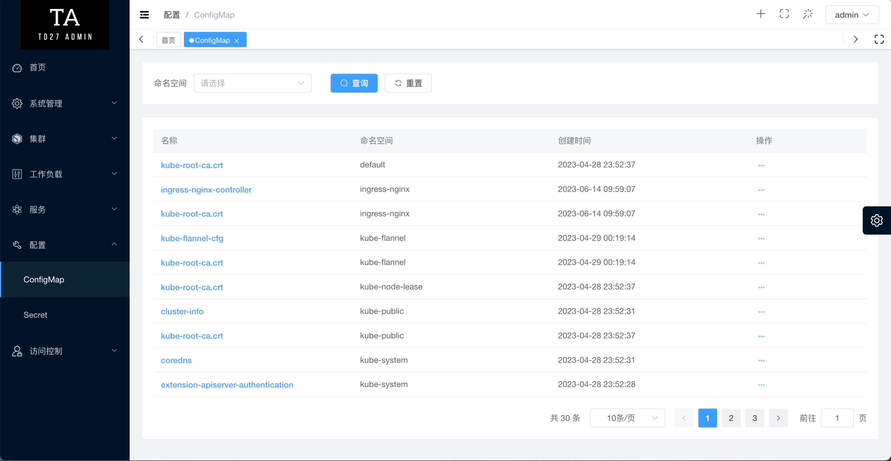
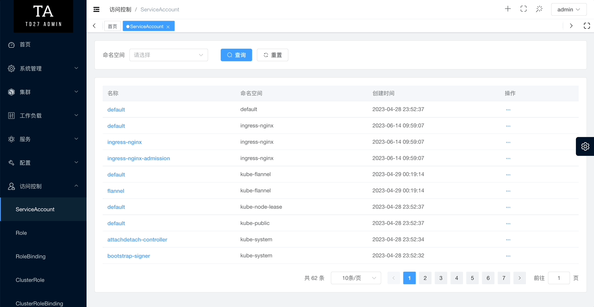
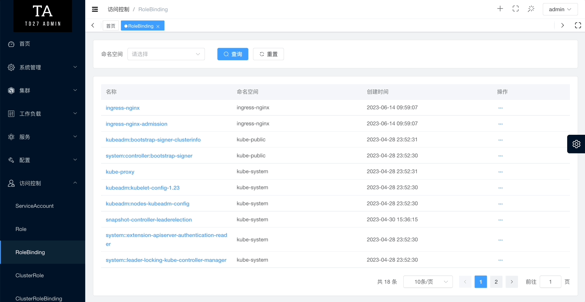
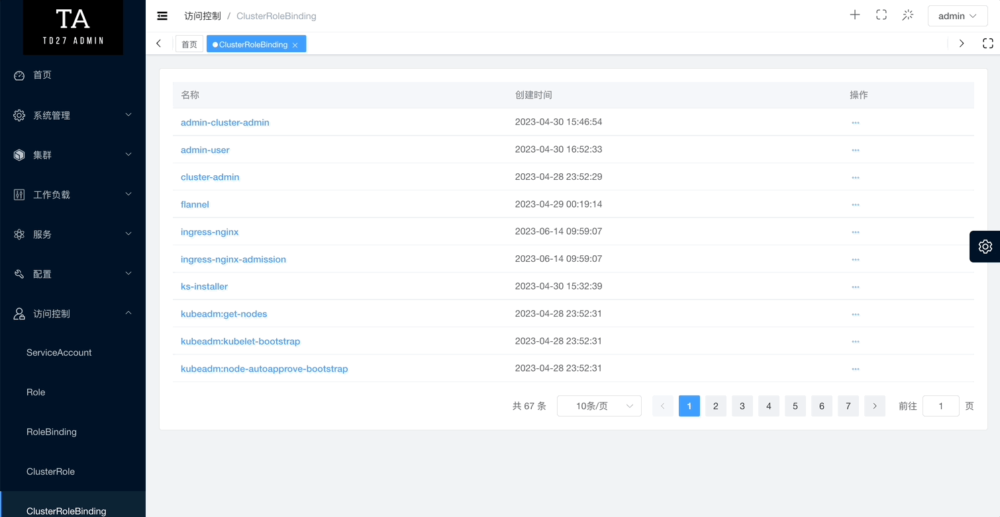

<h1 align="center" style="margin: 30px 0 30px; font-weight: bold;">KubeFish</h1>
<h4 align="center">K8s Dashboard</h4>
<hr />

KubeFish 是一个现代化的 K8s 面板

## 功能展示

### 创建资源


### 集群

#### 节点


#### 命名空间


### 工作负载

#### Pod


#### ReplicaSet


#### Deployment


#### DaemonSet


### 配置

#### ConfigMap


#### Secrets


### 访问控制

#### ServiceAccount


#### Role && RoleBinding


#### ClusterRole && ClusterRoleBinding


## 安装

### 集群外安装

Docker Compose 版本需要 V2

```bash
git clone https://github.com/pddzl/kubefish
cd kubefish
# 添加k8s config文件 (/etc/kubernetes/admin.conf 重命名为config)
# cp /tmp/config docker-compose/k8s
docker-compose -f docker-compose/docker-compose.yml build
docker-compose -f docker-compose/docker-compose.yml up -d
```

浏览器打开 `http://node节点:35999`

## 致谢
 + 项目脚手架 [td27-admin](https://github.com/pddzl/td27-admin)

## 📄 License

[MIT](./LICENSE)

Copyright (c) 2022-present [pddzl](https://github.com/pddzl)
